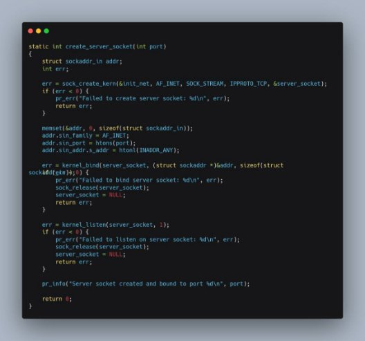
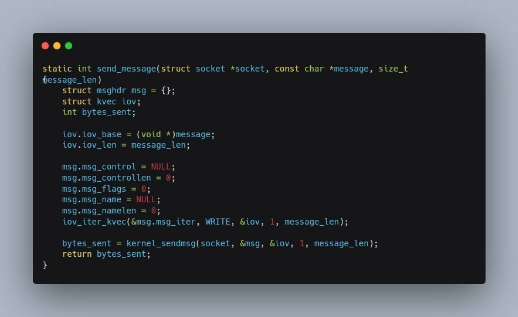

- **보안 관리 측면에서의 커널 레벨의 소켓 서버의 필요성과 활용 >** 

2022312675  구래건 

1. **서론** 

커널은  하드웨어  리소스와  시스템  상태에  직접  접근할  수  있는  권한을  가지고  있다.  이와는 대조적으로  사용자  공간에서는  이러한  접근이  제한되어  있다.  커널  레벨의  소켓  서버를  통해, 커널이  접근  가능한  특정  데이터에  접근할  수  있다는  점은  해킹과  보안  관점에서  중요한  역할

을  할  수  있다.  해커들은  일반적으로  서버에  침입한  후에  자신들의  흔적을  남기지  않기  위해 보안  및  시스템  관련  로그를  제거한다.  이렇게  되면  사용자  및  관리자는  서버에  어떤  행위가 발생했는지  파악하기가  매우  어려워지며,  추가적인  침입의  위험성도  증가한다.  이런  상황에서 커널  레벨의  TCP 서버를  사용하면,  외부  시스템에  시스템  로그를  저장  및  보관할  수  있고,  이

를  통해  해킹으로  인한  피해를  최소화할  수  있다.  커널  레벨의  TCP  서버를  사용하면,  시스템 관리  측면에서도  중요한  이점을  얻을  수  있다.  시스템이  비정상적으로  종료되거나  다른  이상 상태가  발생해  서버에  직접적으로  접근할  수  없는  경우에도  원격으로  로그를  저장해두었기  때 문에,  오류를  쉽게  파악할  수  있기  때문이다.  

이러한  방식으로  시스템  로그를  커널  레벨에서  수집하고  보관하는  행위는  서버의  보안을  강화 하고  시스템  상태를  모니터링하는  데  도움이  된다.  또한,  커널  레벨에서  작동하는  TCP 서버는 일반  사용자  공간의  악성  코드나  해킹  시도로부터  격리되어  있으므로,  시스템의  안정성과  보 안성을  높일  수  있다.  하지만  이러한  접근  방식은  오히려  결점이  될  수  있다.  커널  레벨에서의 데이터  접근과  TCP 서버  자체가  해킹이  된다면  서버의  중요한  로그가  해커에게  전달될  수  있

기  때문이다.  따라서  적절한  보안  대책과  접근  제어  메커니즘을  통해  이를  예방하는  것  또한 매우  중요하다.  따라서  본  보고서에서는  특정  ip만  허용하는  메커니즘  및  클라이언트의  파일 요청을  받아  파일을  송신하는  코드,  채팅을  가능하게  하는  코드를  구현해  보겠다. 

2. **본론 –  구현** 
1. 교안  대로, WSL2-Linux-Kernel을  설치한  뒤 make를  진행해  커널을  올려준다. 
1. 본디  WSL2-Linux-Kernel/kernel에서  코드를  짜고  진행해야  하지만,  이럴  경우  매  컴 파일  마다  많은  시간이  소요될  수  있기에,  우선  kernel module을  만들어  코딩을  진행 하고,  기능을  테스트해  보았다.  그리고  커널  모듈  컴파일  진행에  대해  해당  과정을  영 상으로  만들었다. h[ttps://www.youtube.com/watch?v=xXmHCfNvJGk&t=2s](https://www.youtube.com/watch?v=xXmHCfNvJGk&t=2s)
1. 대부분의  기능이  안정적으로  진행되자,  본격적으로  시스템  콜로써  구현하기  위해  커널 파일을  수정하였다. 
1. 우선,  WSL2-Linux-Kernel/kernel에  코드를  작성하였다.  커널  모듈과  다른  문법 이  있기에  일부  코드를  수정하고, chatserver.c  라는  이름으로  코드를  작성하였다. 
1. WSL2-Linux-Kernel/kernel에  존재하는  Makefile의  obj-y에  chatserver.o  를 추가해  이를  컴파일  대상으로  인식할  수  있게  하였다.  

3. 다음으로, WSL2-Linux-Kernel/arch/x86/entry/syscalls  에  있는  syscall\_64.tbl을 수정하여  시스템  콜  고유  번호를  추가해  주었다.  이작업으로  인해  유저레벨에서 시스템콜을  해당  번호(451)를  통해  호출  할  수  있게  된다. 

4. WSL2-Linux-Kernel/include/linux/syscalls.h에  asmlinkage를  통해  함수를  선언 한다.  메시지,  허용할  ip를  입력으로  받았다.

5. 위의  사항을  잘  마무리  했으면,  커널  컴파일을  재  진행하여  새로  생성된 vmlinux  파일로  기존의  vmlinux를  대채  한  뒤,  다시  시작한다. 
4. **소스  코드  설명.** 

MAX\_FILENAME\_LEN: 전송할  파일의  최대  경로  및  이름  길이를  나타낸다. MAX\_MESSAGE\_LEN:  전송할  메시지의  최대  길이를  나타낸다. MAX\_IP\_LEN: IP길이의  최대값을  지정한다. 

port:  서버가  사용할  포트  번호를  나타내는  변수이다.  

server\_socket:  서버  소켓을  가리키는  포인터  변수로, NULL로  초기  설정하였다.  client\_socket:  클라이언트  소켓을  가리키는  포인터  변수로, NULL로  초기  설정하였다.  

함수  create\_server\_socket는  주어진  포트  번호에  서버  소켓을  생성하고,  해당  소켓을  지정된 포트에  바인딩하며,  연결  요청을  받을  수  있도록  리스닝  상태로  설정하는  역할을  한다. 

매개변수는  다음과  같다. 

1. int형  반환값을  가지며,  생성된  서버  소켓에  대한  오류  여부를  반환한다. 
1. int형  매개변수  port는  서버  소켓이  바인딩될  포트  번호를  나타낸다. 
1. struct sockaddr\_in형  변수  addr는  소켓  주소  구조체로  사용된다. 
1. int형  변수  err은  함수  수행  중  발생한  오류를  저장한다. 

함수는  다음과  같이  동작한다. 

1. sock\_create\_kern  함수를  사용하여  커널  내부에서  서버  소켓을  생성하고,  생성된 

소켓은  server\_socket  변수에  저장된다. 

2. memset  함수를  사용하여  addr  변수를  초기화한다. 
2. addr의  필드  값을  설정하여  소켓  주소  구조체를  초기화합니다.  AF\_INET은  IPv4 주소  체계를  사용함을  나타내며, htons  함수를  사용하여  포트  번호를  네트워크  바 이트  순서로  변환한다. 
2. kernel\_bind  함수를  사용하여  서버  소켓을  addr에  바인딩한다.  sizeof(struct sockaddr\_in)은  소켓  주소  구조체의  크기를  나타낸다. 
2. kernel\_listen  함수를  사용하여  서버  소켓을  리스닝  상태로  설정한다. 1은  동시에 처리할  수  있는  최대  연결  요청의  개수를  의미한다. 
2. 서버  소켓이  성공적으로  생성,  바인딩  및  리스닝  되었음을  로그로  출력한다. 

tcp\_socket\_exit  함수는  서버  소켓과  클라이언트  소켓을  해제하여  TCP  소켓을  종료 한다. 

함수는  다음과  같이  동작한다. 

1. server\_socket이  유효한  경우에는  sock\_release  함수를  호출하여  서버  소켓을  해 제한다. 
1. server\_socket을  NULL로  설정한다.  마찬가지로  client\_socket이  유효한  경우에도 동일한  과정을  수행한다. . 

receive\_message  함수는  주어진  소켓으로부터  메시지를  수신하고,  수신된  메시지를  지정된 버퍼에  저장하며,  수신된  메시지를  로그에  출력한다.  

`    `매개변수는  다음과  같다. 

`        `struct socket \*socket:  메시지를  수신할  소켓  객체         char \*buffer:  수신된  메시지를  저장할  버퍼 

`        `size\_t buffer\_size:  버퍼의  크기 

`    `반환: 

`         `성공적으로  메시지를  수신한  경우,  수신된  바이트  수를  반환한다.          메시지  수신에  실패한  경우, -1을  반환한다. 

`    `함수는  다음과  같이  동작한다. 

1. 수신할  메시지를  저장할  struct msghdr  객체인  msg를  초기화한다. 
2. 수신된  메시지를  저장할  struct kvec  객체인  iov를  초기화한다. 
2. 수신된  메시지를  버퍼에  저장할  struct iov\_iter  객체인  iter를  초기화한다. 
2. iov  객체에  버퍼와  버퍼의  크기를  설정한다. 
2. msg  객체의  필드를  설정한다.  메시지를  하나씩  msg\_flags를  0으로  설정한다. 
2. iov\_iter\_kvec  함수를  사용하여  iter  객체를  초기화한다. 
2. kernel\_recvmsg  함수를  사용하여  소켓으로부터  메시지를  수신하고,  수신된  바이 트  수를  bytes\_received에  저장한다. 

`        `8-1.  수신이  실패한  경우,  에러를  로그에  출력하고  -1을  반환한다.         8-2.  수신된  메시지를  로그에  출력한다. 

9\.  수신된  바이트  수를  반환한다. 

send\_message  함수는  주어진  소켓으로  메시지를  전송하는  역할을  수행한다.  

매개변수는  다음과  같다. 

`        `struct socket \*socket:  메시지를  전송할  소켓  객체 

`        `const char \*message:  전송할  메시지  문자열 

함수는  다음과  같이  동작한다. 

1. 함수  내부에서는  주어진  메시지를  socket으로  전송하기  위해  필요한  데이터  구조를 설정하고,  실제  전송  작업을  수행한다.  
2. 메시지를  전송하기  위해  kvec  구조체를  사용하여  전송할  데이터를  설정하고, msghdr 구조체를  초기화하여  메시지  속성을  설정한다.  
2. 3.kernel\_sendmsg  함수를  호출하여  소켓을  통해  메시지를  전송한다. 
2. 전송이  성공하면  전송된  바이트  수를  반환하고,  실패하면  오류  코드를  반환한다. 

send\_file  함수는  주어진  파일을  소켓을  통해  클라이언트로  전송하는  역할을  한다.      매개변수는  다음과  같다. 

`        `struct socket \*socket:  파일  데이터를  전송할  소켓  객체 

`        `const char \*filename:  전송할  파일의  경로  및  이름 

함수는  다음과  같이  동작한다. 

1. 함수  내부에서는  주어진  파일을  열고,  읽은  데이터를  소켓으로  전송한다.  
2. 파일을  열기  위해  filp\_open  함수를  사용하고,  데이터를  임시로  저장할  버퍼를  할 당하기  위해  kmalloc  함수를  사용한다.  
2. 파일을  읽는  동안  kernel\_read  함수를  호출하여  데이터를  읽는다. 
2. send\_message  함수를  사용하여  소켓으로  데이를  전송한다. 
2. 전송이  성공하면  전송된  바이트  수를  반환하고,  실패하면  오류  코드를  반환한다. 
2. 함수가  종료되면  할당된  버퍼를  해제하고  파일을  닫는다. 

SYSCALL\_DEFINE2(server, const char \_\_user \*, message, const char \_\_user \*, client\_ip\_arg) 

{ 

`    `int err; 

`    `char buffer[100]; 

`    `bool is\_file\_request = false; 

`    `char filename[MAX\_FILENAME\_LEN] = "my\_file.txt"; 

`    `int bytes\_sent; 

`    `struct sockaddr\_in addr; 

`    `int addrlen; 

`    `char client\_ip[MAX\_IP\_LEN]; 

`    `char kernel\_client\_ip[MAX\_IP\_LEN]; 

`    `addrlen = sizeof(addr); 

`    `err = create\_server\_socket(port); 

`    `if (err < 0) { 

`        `pr\_err("Failed to create server socket: %d\n", err);         return err; 

`    `} 

// Copy client\_ip\_arg to kernel buffer 

`    `if (copy\_from\_user(kernel\_client\_ip, client\_ip\_arg, MAX\_IP\_LEN) != 0) {         pr\_err("Failed to copy client IP address\n"); 

`        `tcp\_socket\_exit(); 

`        `return -EFAULT; 

`    `} 

`    `while (1) { 

`        `// 클라이언트의  연결  수락 

`        `err = kernel\_accept(server\_socket, &client\_socket, 0); 

`        `if (err < 0) { 

`            `pr\_err("Failed to accept client connection: %d\n", err);             break; 

} 

pr\_info("Accepted client connection\n"); 

`        `// 클라이언트의  IP 주소 확인 

`        `if (kernel\_getpeername(client\_socket, (struct sockaddr \*)&addr) 

- 0) { 

`            `pr\_err("Failed to get client IP address\n"); 

`            `sock\_release(client\_socket); 

`            `continue; // 다음 클라이언트의  연결  시도를  기다립니다.

`        `} 

`        `// 클라이언트의  IP 주소를  문자열로  변환 

`        `snprintf(client\_ip, MAX\_IP\_LEN, "%pI4", &addr.sin\_addr.s\_addr); 

`        `// 클라이언트의  IP 주소가  client\_ip\_arg 와 일치하는지  확인 

`        `if (strcmp(client\_ip, kernel\_client\_ip) != 0) { 

`            `pr\_err("Access denied for client IP: %s\n", client\_ip);             sock\_release(client\_socket); 

`            `continue; // 다음 클라이언트의  연결  시도를  기다립니다.

`        `} 

`        `while (1) { 

`            `int bytes\_received = receive\_message(client\_socket, buffer, sizeof(buffer)); 

`            `char kernel\_message[MAX\_MESSAGE\_LEN]; 

`            `if (bytes\_received < 0) { 

`                `pr\_err("Failed to receive message(server\_init): %d\n", bytes\_received); 

`                `break; 

`            `} 

`            `if (copy\_from\_user(kernel\_message, message, MAX\_MESSAGE\_LEN - 1) != 0) {                 pr\_err("Failed to copy user message\n"); 

`                `break; 

`            `} 

`            `kernel\_message[MAX\_MESSAGE\_LEN - 1] = '\0';  // 문자열  종료를 위해  널 문자 추가 

`            `pr\_info("Received message: %s\n", kernel\_message); 

`            `bytes\_sent = send\_message(client\_socket, kernel\_message, strlen(kernel\_message)); 

`            `if (strncmp(buffer, "FILE:", 5) == 0) { 

`                `memset(filename, 0, MAX\_FILENAME\_LEN); 

`                `strncpy(filename, buffer + 5, MAX\_FILENAME\_LEN - 1); 

bytes\_sent = send\_file(client\_socket, filename); 

`                `if (bytes\_sent < 0) { 

`                    `pr\_err("Failed to send file: %.\*s\n", MAX\_FILENAME\_LEN, filename); 

`                    `break; 

`                `} 

`                `pr\_info("File sent: %s, Bytes sent: %d\n", filename, bytes\_sent); 

`                `is\_file\_request = true; 

`            `} else { 

`                `// 일반 메시지  전송 

`                `if (is\_file\_request) { 

`                    `// 파일  전송  후 첫 메시지인  경우에만 "Hello, client!" 메시지를  전송 

`                    `char greeting\_message[30] = "Hello, client!"; 

`                    `bytes\_sent = send\_message(client\_socket, greeting\_message, strlen(greeting\_message)); 

`                    `if (bytes\_sent < 0) { 

`                        `pr\_err("Failed to send greeting message: %d\n", bytes\_sent); 

`                        `break; 

`                    `} 

`                    `is\_file\_request = false; 

`                `} else { 

`                    `if (bytes\_sent < 0) { 

`                        `pr\_err("Failed to send message: %d\n", bytes\_sent); 

`                        `break; 

`                    `} 

`                `} 

`            `} 

`        `} 

`        `// 클라이언트  소켓  해제 

`        `if (client\_socket) { 

`            `sock\_release(client\_socket);             client\_socket = NULL; 

`        `} 

`    `} 

tcp\_socket\_exit(); 

`    `return 0; } 

SYSCALL\_DEFINE2(server, const char \_\_user \*, message, const char \_\_user \*, client\_ip\_arg)  함수는  서버  역할을  수행하는  시스템  호출  함수이다.  클라이언트의  연 결을  수락하고,  메시지를  주고받으며,  파일을  전송하는  서버  역할을  수행한다. 

매개변수는  다음과  같다. 

const char \_\_user \*message:  사용자로부터  전달받은  메시지를  가리키는  포인터. const char \_\_user \*client\_ip\_arg:  클라이언트의  IP 주소를  가리키는  포인터. 함수는  다음과  같이  동작한다. 

1. 함수  내부에서  create\_server\_socket  함수를  호출하여  서버  소켓을  생성한다.  생 성에  실패하면  오류  코드를  반환하고  함수를  종료한다. 
1. 그  후,  무한  루프를  실행하여  클라이언트의  연결을  수락하고,  메시지를  주고받으 며,  파일을  전송한다. 
1. 각  루프  반복에서는  kernel\_accept  함수를  사용하여  클라이언트의  연결을  수락한 다.  연결  수락에  실패하면  오류  코드를  반환하고  루프를  종료한다.  
1. 수락한  클라이언트의  ip주소가  커널에서  허용하기로  한  ip와  일치한다면  접속을 유지하고,  아니라면  연결을  종료한다.  
1. 수락된  클라이언트와  메시지를  수신하고,  사용자  공간에서  작성된  메시지를  커널 로  메시지를  복사한뒤, send\_message  함수를  사용하여  클라이언트에게  전송한다. 
1. 수신된  메시지가  "FILE:"로  시작하는  경우,  해당  메시지는  파일  요청을  의미하며, 파일명을  추출하여  send\_file  함수를  호출하여  파일을  전송한다.  파일  전송에  실 패하면  오류  메시지를  출력하고  루프를  종료한다. 
1. 파일  전송이  이루어진  후  메시지로  클라이언트에게  "Hello,  client!"  메시지를  전 송한다.  
1. 각  루프  반복  후에는  클라이언트  소켓을  해제한다. 
1. tcp\_socket\_exit  함수를  호출하여  서버  소켓을  종료한다. 

**5.  Userlevel syscall  호출  코드  및  client  코드  설명** 

위  코드는  sys\_server()  시스템  콜을  호출한다.  사용자로부터  메시지  및  ip주소를  입 력받고,  해당  아이피와  메시지를  인자로  sys\_server()  시스템  콜을  호출한다. 

코드는  다음과  같이  동작한다 

1. 사용자로부터  메시지를  입력  받는다. 
1. 사용자로부터  접속을  허용할  아이피를  입력  받는다. 
1. syscall()  함수를  사용하여  sys\_server()  시스템  콜을  호출한다. 451은  시 스템  콜  번호로,  전달할  message,  접속을  허용할  아이피를  인자로  전달 한다.   

클라이언트  코드 

#include <unistd.h> #include <stdio.h> #include <stdlib.h> #include <string.h> #include <sys/socket.h> #include <netinet/in.h> #include <arpa/inet.h> 

#define SERVER\_IP "127.0.0.1" #define SERVER\_PORT 4320 #define BUFFER\_SIZE 1024 

void receive\_file(int sockfd, const char \*filename) {     FILE \*file = fopen(filename, "wb"); 

`    `if (!file) { 

`        `perror("Failed to open file for writing"); 

`        `return; 

`    `} 

char buffer[BUFFER\_SIZE]; int bytes\_received; 

`    `// 파일 데이터  수신 

`    `while ((bytes\_received = recv(sockfd, buffer, sizeof(buffer), 0)) > 0) {         fwrite(buffer, 1, bytes\_received, file); 

`    `} 

fclose(file); 

`    `if (bytes\_received < 0) { 

`        `perror("Failed to receive file");         return; 

`    `} 

`    `printf("File received: %s\n", filename); 

} 

int receive\_message(int sockfd, char \*buffer, size\_t buffer\_size) {     int bytes\_received = recv(sockfd, buffer, buffer\_size, 0); 

`    `if (bytes\_received < 0) { 

`        `perror("Failed to receive message"); 

`        `return -1; 

`    `} else if (bytes\_received == 0) { 

`        `printf("Connection closed by server\n"); 

`        `return -1; 

`    `} else { 

`        `printf("Received message: %.\*s\n", bytes\_received, buffer);         return bytes\_received; 

`    `} 

} 

int send\_message(int sockfd, const char \*message) { 

`    `int bytes\_sent = send(sockfd, message, strlen(message), 0);     if (bytes\_sent < 0) { 

`        `perror("Failed to send message"); 

`        `return -1; 

`    `} 

`    `return bytes\_sent; 

} 

int main() { 

`    `int sockfd; 

`    `struct sockaddr\_in server\_addr;     char buffer[BUFFER\_SIZE]; 

`    `char filename[BUFFER\_SIZE]; 

`    `// 소켓 생성 

`    `sockfd = socket(AF\_INET, SOCK\_STREAM, 0);     if (sockfd < 0) { 

`        `perror("Failed to create socket"); 

`        `exit(EXIT\_FAILURE); 

`    `} 

`    `// 서버 주소  설정 

`    `memset(&server\_addr, 0, sizeof(server\_addr)); 

`    `server\_addr.sin\_family = AF\_INET; 

`    `server\_addr.sin\_port = htons(SERVER\_PORT); 

`    `if (inet\_pton(AF\_INET, SERVER\_IP, &server\_addr.sin\_addr) <= 0) {         perror("Invalid server IP address"); 

`        `exit(EXIT\_FAILURE); 

`    `} 

`    `// 서버에  연결 

`    `if (connect(sockfd, (struct sockaddr \*)&server\_addr, sizeof(server\_addr)) 

- 0) { 

`        `perror("Failed to connect to server"); 

`        `exit(EXIT\_FAILURE); 

`    `} 

`    `// 메시지  전송  및 파일  수신     while (1) { 

`        `// 메시지  입력 

`        `printf("Enter your message (or file name to receive, 'exit' to quit):\n"); 

`        `fgets(buffer, BUFFER\_SIZE, stdin); 

`        `buffer[strcspn(buffer, "\n")] = '\0';  // 개행 문자  제거 

`        `// "exit" 입력 시 종료 

`        `if (strcmp(buffer, "exit") == 0) {             break; 

`        `} 

`        `// 파일  수신  요청인  경우 

`        `if (strncmp(buffer, "FILE:", 5) == 0) { 

`            `memset(filename, 0, sizeof(filename)); 

`            `strncpy(filename, buffer + 5, sizeof(filename) - 1); 

`            `if (send\_message(sockfd, buffer) < 0) {                 break; 

`            `} 

`            `receive\_file(sockfd, filename); 

`        `} else {  // 일반  메시지  전송 

`            `if (send\_message(sockfd, buffer) < 0) {                 break; 

`            `} 

`            `// 메시지 수신 

`            `receive\_message(sockfd, buffer, sizeof(buffer));         } 

`    `} 

// 소켓 닫기 close(sockfd); 

`    `return 0; } 

일반적인  소켓  클라이언트  처럼  작성되었다. 

1. 서버의  IP 주소,  포트  번호,  버퍼  크기  등을  정의한다. 
1. receive\_file  함수는  소켓으로부터  파일을  수신하여  지정된  파일에  저장하 는  역할을  수행한다. 
1. receive\_message  함수는  소켓으로부터  메시지를  수신하는  역할을  수행 한다. 
1. send\_message  함수는  소켓을  통해  메시지를  전송하는  역할을  수행한다. 
5. main  함수에서는  클라이언트  소켓을  생성하고,  서버의  주소를  설정하여 서버에  연결한다. 
5. 메시지를  입력받고, "exit"를  입력할  때까지  반복하여  처리한다. 
5. 만약  입력된  메시지가  "FILE:"로  시작하는  경우,  파일  수신을  요청하고 receive\_file  함수를  호출하여  파일을  수신한다. 
5. 그렇지  않은  경우에는  일반  메시지를  전송하고, receive\_message  함수를 호출하여  서버로부터  메시지를  수신한다. 
5. 사용이  끝난  소켓을  닫는다. 

**6.  실행  결과** 

1. Ip  불일치로  접속  불가  상황 

2. 접속  후  메시지  교환 

3. 접속  후  파일  교환 

**7.  결론** 

결론적으로,  커널  레벨의  TCP  서버는  시스템  로그를  커널에서  수집하고  보관하여  서버의  보 안을  강화하고  시스템  상태를  모니터링하는  데  도움을  줄  수  있다.  이  방식은  커널이  접근  가 능한  데이에  접근하므로  해킹으로  인한  피해를  최소화할  수  있으며,  서버의  안정성과  보안 성을  높일  수  있다. 

그러나  이러한  접근  방식은  오히려  보안  결점이  될  수도  있다.  만약  커널  레벨에서의  데이터 접근과  TCP 서버  자체가  해킹당한다면,  중요한  로그가  해커에게  전달될  수  있기  때문이다.  따 라서  적절한  보안  대책과  접근  제어  메커니즘을  구현하여  이러한  위험을  예방해야  한다. 

본  보고서에서는  특정  IP만  허용하는  메커니즘과  클라이언트의  파일  요청을  받아  파일을  송신 하는  기능,  채팅을  가능하게  하는  코드를  구현했다.  이를  통해  보안  및  파일  전송,  채팅  기능 을  제공하는  TCP 서버를  구현할  수  있다. 

프로그램  실행  결과를  확인하고,  예상대로  파일  전송과  채팅이  작동하는지  확인했다.  이를  통 해  프로그램이  정상적으로  동작함을  확인할  수  있었다. 

커널  레벨의  TCP  서버는  보안과  시스템  모니터링  측면에서  중요한  역할을  할  수  있으며,  적 절한  보안  대책과  접근  제어를  구현하여  해킹으로부터의  위험을  최소화해,  서버의  안정성과 보안성을  강화할  수  있다. 
